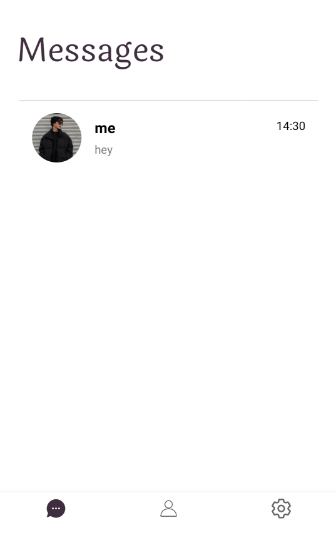
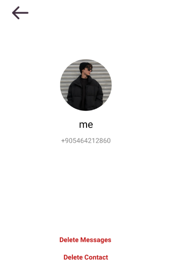

# ChatCraft

ChatCraft is a simple chat application developed using the Kotlin programming language and the Firebase cloud platform.

## Features

- Real-time messaging
- User accounts and login/authentication
- Emoji support for messages
- **Private Messages:** One-on-one private messaging between users
- **Profile Photo:** Allowing users to add a profile photo.

## Technologies
- **Kotlin:** Main programming language
- **Firebase Authentication:** For user identity verification and session management
- **Firebase Firestore:** For real-time database
- **Firebase Storage:** For storing media files

## Screenshots and descriptions

When the app is first opened, users are greeted with a simple and user-friendly welcome screen. This screen provides users with information about the basic features of the app and allows them to get started quickly.

The welcome screen also guides users to log in to the application. Through the secure login process provided by Firebase Authentication, users can easily create an account with their phone numbers and log into the app.

Here, we prompt the user to enter their name.

On this page, we ask the user to select their country code and then enter their phone number.

On this page, we prompt the user to enter the verification code sent to their phone by Firebase.

After successfully logging into the application, you will encounter this page. If you add a contact from the contacts page, it will also appear on this page.

Chatting with the person you added will look just like this.

Seeing the profile picture of the person you are chatting with, deleting your messages, or removing the contact happens on this page.

This page is your contact list. By pressing the circle in the bottom right and adding contacts, you can have pleasant conversations with them. However, there is one condition: the person you're adding must be using this application :)

Contacts Adding Page

This page allows you to set your profile picture, name, or log out of the application.

